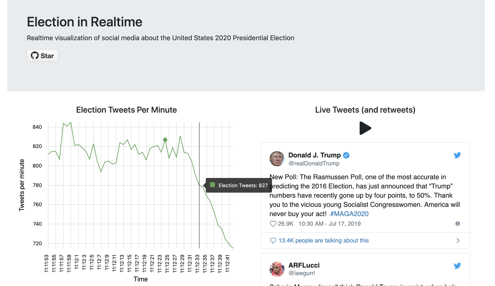

# Visualizing live election tweets
### Using Redis, Elasticsearch, ExpressJS, and Angular to search high-volume tweets in real-time.

## Getting started

`git clone https://github.com/cpgeier/real-time.ml.git`

`cd real-time.ml/site`

`npm install && ng serve --prod`

## Background

There are more than 10 tweets per second about current politics in America. Wouldn't it be cool to have a way to see these tweets in real-time? This repo is an implimentation of a high-volume data framework that consumes streaming data from Twitter and visualizes the tweets in an Angular front-end. Although this project specifically focuses on tweets about US politics, the parameters in this repo can be changed to visualize any topic on Twitter. 

## Building the repo
  - Configure environment file
    - Elasticsearch url
    - Twitter API config
  - In stream folder: `docker-compose up`
  - In api folder: `node index`
  - In site folder: `ng serve`

## Hosting online
  - Netlify to host site folder
  - Bonsai to host elasticsearch
  - Heroku to host expressjs api
  - Host Docker-machine using any cloud service https://docs.docker.com/machine/drivers/

